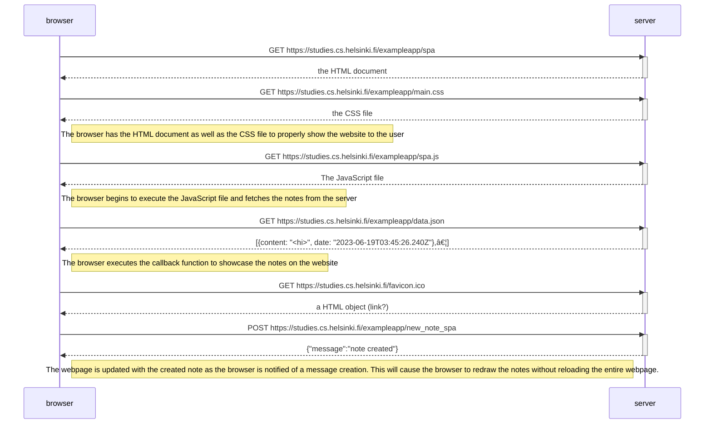

```mermaid
sequenceDiagram
    participant browser
    participant server
    
    browser->>server: GET https://studies.cs.helsinki.fi/exampleapp/spa
    activate server
    server-->>browser: the HTML document
    deactivate server
    
    browser->>server: GET https://studies.cs.helsinki.fi/exampleapp/main.css
    activate server
    server-->>browser: the CSS file
    deactivate server
    
    Note right of browser: The browser has the HTML document as well as the CSS file to properly show the website to the user
    
    browser->>server: GET https://studies.cs.helsinki.fi/exampleapp/spa.js
    activate server
    server-->>browser: The JavaScript file
    deactivate server

    Note right of browser: The browser begins to execute the JavaScript file and fetches the notes from the server

    browser->>server: GET https://studies.cs.helsinki.fi/exampleapp/data.json
    activate server
    server-->>browser: [{content: "<hi>", date: "2023-06-19T03:45:26.240Z"},…]
    deactivate server

    Note right of browser: The browser executes the callback function to showcase the notes on the website

    browser->>server: GET https://studies.cs.helsinki.fi/favicon.ico
    activate server
    server-->>browser: a HTML object (link?)
    deactivate server

    browser->>server: POST https://studies.cs.helsinki.fi/exampleapp/new_note_spa
    activate server
    server-->>browser: {"message":"note created"}
    deactivate server

    Note right of browser: The webpage is updated with the created note as the browser is notified of a message creation. This will cause the browser to redraw the notes without reloading the entire webpage.
```